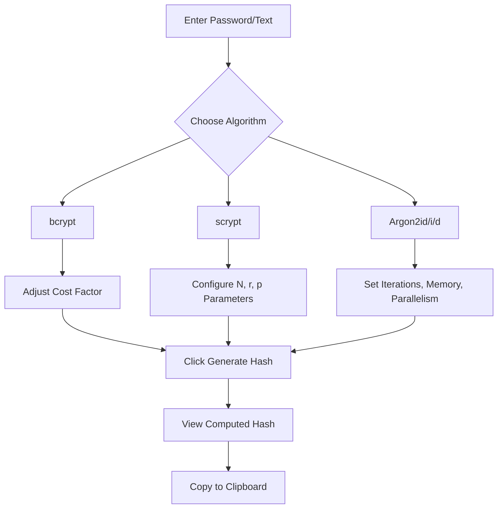
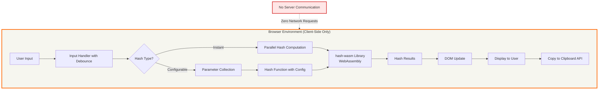

# xsukax Cryptographic Hash Generator

A privacy-focused, client-side cryptographic hash generation tool that computes multiple hash algorithms simultaneously in real-time directly within your browser.

[](https://xsukax.github.io/xsukax-Cryptographic-Hash-Generator)
[](https://www.gnu.org/licenses/gpl-3.0)

## Project Overview

The **xsukax Cryptographic Hash Generator** is a comprehensive web-based utility designed for developers, security professionals, and anyone requiring immediate access to multiple cryptographic hash functions. Built as a single-page application with zero server dependencies, it provides instant hash computation across 15+ algorithms including legacy hashes (MD5, SHA-1), modern SHA-2 and SHA-3 variants, BLAKE family hashes, and advanced password hashing functions (bcrypt, scrypt, Argon2).

The application distinguishes itself by computing all standard hash algorithms simultaneously as you type, eliminating the need for repeated manual operations. For advanced use cases requiring parameter configuration—such as password hashing with adjustable cost factors—the tool provides intuitive controls with sensible defaults.

## Security and Privacy Benefits

### Complete Client-Side Processing
All cryptographic computations execute entirely within your browser using WebAssembly-optimized implementations via the hash-wasm library. **No data ever leaves your device**—no network requests, no server uploads, no third-party analytics. Your sensitive information remains under your complete control.

### Zero Data Persistence
The application maintains no local storage, cookies, or cached data. Hash computations are performed in real-time and exist only in volatile memory. Closing the browser tab permanently erases all processed information, ensuring no forensic trace remains.

### Transparent Operation
As an open-source tool with fully auditable code, security researchers and privacy-conscious users can verify the application's behavior. The entire functionality resides in a single HTML file, making comprehensive security audits straightforward and establishing trust through transparency.

### Cryptographically Secure Random Generation
For password hashing algorithms requiring salt values (bcrypt, scrypt, Argon2), the application utilizes the browser's `crypto.getRandomValues()` API, which provides cryptographically secure pseudorandom numbers suitable for security-sensitive operations.

### Legacy Algorithm Warnings
Algorithms with known vulnerabilities (MD5, SHA-1) are clearly marked with warning indicators, educating users about security implications while still providing access for compatibility or research purposes.

## Features and Advantages

- **Real-Time Multi-Hash Computation**: Generates 15 different hash outputs simultaneously as you type, with automatic debouncing for optimal performance
- **Comprehensive Algorithm Support**:
  - Legacy: MD5, SHA-1
  - SHA-2 Family: SHA-224, SHA-256, SHA-384, SHA-512
  - SHA-3 Family: SHA3-224, SHA3-256, SHA3-384, SHA3-512
  - BLAKE Family: BLAKE2b, BLAKE2s, BLAKE3
  - Other: RIPEMD-160, Whirlpool
  - Password Hashing: bcrypt, scrypt, Argon2id, Argon2i, Argon2d

- **Advanced Password Hashing with Configuration**: Adjustable parameters for cost factors, memory usage, and parallelism to match security requirements
- **One-Click Hash Copying**: Instant clipboard integration for all computed hashes
- **Zero Dependencies Beyond Hash Library**: Self-contained application requiring only modern browser support
- **Responsive Design**: Clean, HackerNews-inspired interface optimized for readability and usability
- **No Installation Required**: Access directly through any web browser without downloads or setup
- **Offline Capable**: Once loaded, functions completely without internet connectivity

## Installation Instructions

### Option 1: Use Live Demo (Recommended)
Access the application immediately without installation:
```
https://xsukax.github.io/xsukax-Cryptographic-Hash-Generator
```

### Option 2: Local Deployment

#### Step 1: Clone the Repository
```bash
git clone https://github.com/xsukax/xsukax-Cryptographic-Hash-Generator.git
cd xsukax-Cryptographic-Hash-Generator
```

#### Step 2: Serve the Application
The application requires serving through HTTP/HTTPS due to browser security policies. Choose one method:

**Using Python 3:**
```bash
python -m http.server 8000
```

**Using Python 2:**
```bash
python -m SimpleHTTPServer 8000
```

**Using Node.js (http-server):**
```bash
npx http-server -p 8000
```

**Using PHP:**
```bash
php -S localhost:8000
```

#### Step 3: Access in Browser
Navigate to `http://localhost:8000` in your web browser.

### Option 3: Direct File Opening
While modern browsers may support opening `index.html` directly, some features might be restricted due to CORS policies. Local server deployment (Option 2) is recommended for full functionality.

### System Requirements
- Modern web browser with JavaScript enabled
- WebAssembly support (available in all browsers since 2017)
- No server-side PHP configuration required—application is pure client-side HTML/JavaScript

## Usage Guide

### Basic Hash Generation


1. **Enter Input Text**: Type or paste your text into the input textarea
2. **View Instant Hashes**: All standard hashes compute automatically in the table below
3. **Copy Results**: Click the "Copy" button next to any hash to copy it to your clipboard
4. **Character Count**: Monitor input length via the status indicator

### Advanced Password Hashing



#### bcrypt Configuration
- **Cost Factor** (4-12): Higher values increase computational difficulty exponentially
- Default: 8 (suitable for most applications)
- Recommendation: 10-12 for high-security scenarios

#### scrypt Configuration
- **N (CPU Cost)**: Computational difficulty (2-16384)
- **r (Memory Factor)**: Memory block size (1-16)
- **p (Parallelization)**: Parallel threads (1-4)
- Defaults: N=1024, r=8, p=1

#### Argon2 Variants Configuration
- **Iterations**: Number of passes through memory (1-10)
- **Memory (KB)**: RAM usage (8-4096 KB)
- **Parallelism**: Thread count (1-4)
- Defaults: iterations=3, memory=512KB, parallelism=1
- **Argon2id**: Recommended for general password hashing (hybrid approach)
- **Argon2i**: Optimized for side-channel resistance
- **Argon2d**: Maximizes resistance against GPU attacks

### Application Architecture



## PHP Configuration Note

This application does **not** require PHP or any server-side processing. It is a pure client-side JavaScript application. The mention of PHP in installation options refers only to using PHP's built-in web server as a convenient method to serve static files locally during development or testing. No php.ini configuration or PHP extensions are necessary for the application to function.

## Browser Compatibility

- Chrome/Edge 57+
- Firefox 52+
- Safari 11+
- Opera 44+
- Any browser with WebAssembly support

## Security Considerations

- **Production Use**: For password hashing in production systems, always use server-side implementations with proper salt management and secure storage
- **Salt Values**: Demo uses static salts for configurable hashes; production implementations must use cryptographically random, unique salts per password
- **Legacy Algorithms**: MD5 and SHA-1 are marked with warnings and should only be used for compatibility with legacy systems, not for new security-critical applications
- **Browser Security**: Ensure you're using the official GitHub Pages deployment or verify the integrity of locally hosted versions

## Contributing

Contributions are welcome! Please feel free to submit pull requests, report bugs, or suggest features through the GitHub issue tracker.

## License

This project is licensed under the GNU General Public License v3.0.

---

**Repository**: [https://github.com/xsukax/xsukax-Cryptographic-Hash-Generator](https://github.com/xsukax/xsukax-Cryptographic-Hash-Generator)  
**Live Demo**: [https://xsukax.github.io/xsukax-Cryptographic-Hash-Generator](https://xsukax.github.io/xsukax-Cryptographic-Hash-Generator)
